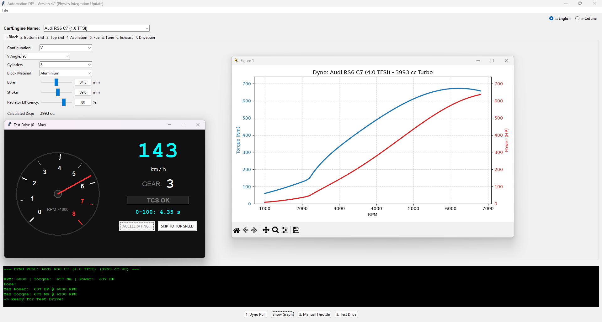

# Automation DIY — Simulátor motoru a vozidla

*[Read in English](README.md)*

Domácí open-source simulátor stavby motoru, virtuálního dyna, dynamiky vozidla a času na kolo, inspirovaný žánrem her ve stylu „Automation“.

Postav motor od klikové hřídele nahoru, otestuj ho na virtuálním dynu, prověř chlazení při ručním plynu, změř zrychlení 0–100 km/h a maximální rychlost a nakonec pošli auto na kompletně simulovanou testovací dráhu dlouhou 3,605 km. Zvuk motoru se generuje procedurálně a živě reaguje na otáčky, plyn, počet válců, typ plnění i klikovou hřídel.

> **Aktuální verze: v4.7 — Custom Gearing & Test Track**



## Funkce

- **Stavba motoru a vozidla na 7 záložkách**: Block, Bottom End, Top End, Aspiration, Fuel & Tune, Exhaust, Drivetrain
- **Fyzikálně založená dyno simulace** s generovanou křivkou točivého momentu a výkonu
- **Nezávislé modely selhání motoru**:
  - mechanické přetočení podle nejslabší klikové hřídele, ojnic nebo pístů
  - klepání a detonace ovlivněné kompresí, plnicím tlakem, předstihem, AFR, palivovou mapou, oktanovým číslem, vstřikováním, materiálem hlavy a technologickou úrovní
- **Telemetrie s ručním plynem** s živou teplotou chladicí kapaliny a možností prasknutí těsnění pod hlavou při přehřátí
- **Simulace 0–100 km/h a maximální rychlosti**, která zohledňuje:
  - ztráty pohonu a rozdíly mezi FWD, RWD a AWD
  - podélný přenos hmotnosti
  - limit přilnavosti pneumatik
  - čelní plochu, součinitel odporu, poloměr kola, valivý odpor a aerodynamický přítlak
  - elektronický omezovač rychlosti i maximálku omezenou převody a otáčkami
- **Volitelné jemné nastavení jednotlivých převodů** pro převodovky se 4–8 stupni
  - při vypnuté volbě zůstávají původní automatické sady převodů
  - po zapnutí lze každý převod upravit samostatně
  - vestavěné presety používají ve výchozím stavu automatické převody, takže si zachovávají své zavedené výsledky
- **Testovací dráha dlouhá 3,605 km s letmým měřeným kolem**
  - tři měřené sektory
  - živé zobrazení rychlosti, převodu, sektoru a času kola
  - brzdné zóny, rychlostní limity v zatáčkách, třecí kružnice pneumatik, akcelerace, odpor vzduchu, přítlak a časové ztráty při řazení
  - jedna společná geometrie pro fyziku i vykreslení, takže zobrazený okruh je přesně ten, který simulátor počítá
- **Procedurálně generovaný zvuk motoru** bez nahraných vzorků
- **Vestavěné tooltips** vysvětlující inženýrský vliv jednotlivých parametrů
- **Bezpečné uložení a načtení** přenositelných JSON konfigurací včetně rozumných výchozích hodnot pro starší soubory
- **Předvolby inspirované reálnými vozy** pro rychlý začátek
- **Dvojjazyčné UI**: čeština a angličtina, přepínatelné za chodu

## Jak začít

### Varianta A — Předkompilované Windows exe

Stáhni nejnovější `.exe` ze stránky [Releases](../../releases) a spusť ho přímo. Instalace Pythonu není potřeba.

> **Známý problém:** při prvním spuštění může antivirus, například Microsoft Defender nebo AVG, krátce zamknout soubor během kontroly nepodepsaného single-file exe. To se může projevit jednorázovou chybou při spuštění. Po dokončení prvního skenu obvykle stačí aplikaci spustit znovu.

### Varianta B — Spuštění ze zdrojového kódu

Vyžaduje Python 3.10+.

```bash
pip install numpy matplotlib sounddevice
python engine_sim.py
```

`tkinter` je součástí většiny standardních instalací Pythonu pro Windows. Na některých linuxových distribucích může být potřeba doinstalovat ho přes systémového správce balíčků.

`sounddevice` a jeho PortAudio backend jsou volitelné. Pokud nejsou dostupné, simulátor běží normálně, pouze jsou vypnuté ovládací prvky živého zvuku motoru.

## Typický postup

1. Vyber preset nebo začni od výchozího buildu.
2. Nastav motor napříč sedmi záložkami.
3. Spusť **1. Dyno Pull**.
4. Prohlédni si graf točivého momentu a výkonu.
5. Volitelně spusť **2. Ruční plyn**.
6. Spusť **3. Zkušební jízdu** pro 0–100 km/h a maximální rychlost.
7. Spusť **4. Testovací dráhu** pro srovnatelný čas letmého kola.
8. Až budeš s buildem spokojený, ulož ho jako JSON.

Kompletní vysvětlení všech záložek, simulačních režimů, modelů selhání, vlastních převodů a testovací dráhy najdeš v **[NAVOD.md](docs/NAVOD.md)**.

## Rozsah simulace

Automation DIY je přístupný herní inženýrský simulátor, nikoliv náhrada profesionálního softwaru pro simulaci spalovacího cyklu, CFD, víceprvkovou dynamiku vozidla nebo motorsportovou simulaci času na kolo.

Výsledky jsou deterministické a vhodné pro porovnávání buildů uvnitř simulátoru. Reálné hodnoty ovlivňují také jevy, které model neřeší, například teplota pneumatik, geometrie podvozku, povrch vozovky, počasí, chování řidiče, přechodová odezva turba, výrobní tolerance a podrobný průběh spalování.

## Upozornění

Některé vestavěné předvolby odkazují na reálné výrobce a modely jako na ilustrativní výkonnostní srovnání. Jde o neoficiální fanouškovské aproximace vytvořené pro vzdělávací a zábavní účely. Projekt není s uvedenými výrobci propojen, podporován jimi ani z jejich dat přímo odvozen.

## Poděkování

Inspirováno žánrem hry *Automation: The Car Company Tycoon Game*. Jde o nezávislý hobby projekt bez jakékoli spojitosti s touto hrou nebo jejími vývojáři.

## Přispívání

Projekt vyrostl z jednoho postupně rozvíjeného skriptu přes mnoho iterací, takže současný kód stále žije převážně v jednom velkém souboru.

Pull requesty jsou vítány. Rozdělení projektu například na moduly `physics.py`, `audio.py`, `gui.py`, `track.py` a `presets.py` by bylo hodnotným prvním příspěvkem ke snadnější údržbě a testování.
