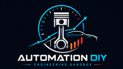
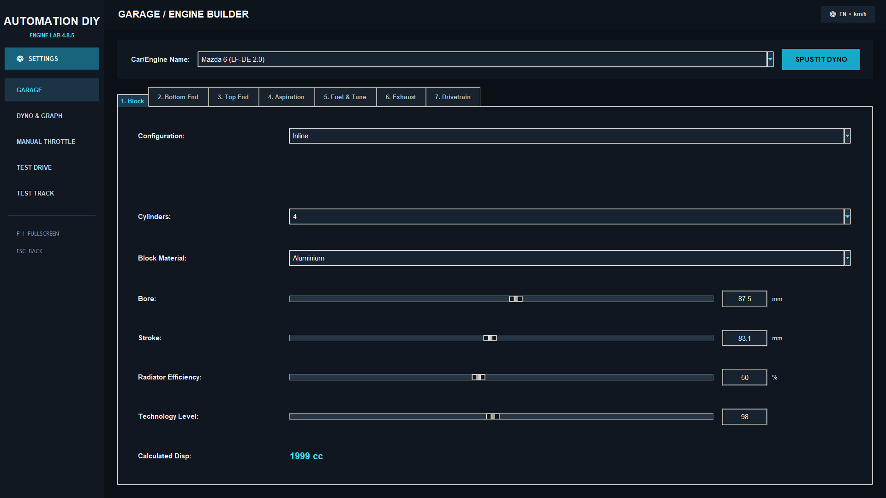
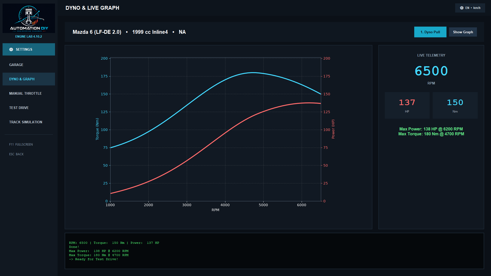
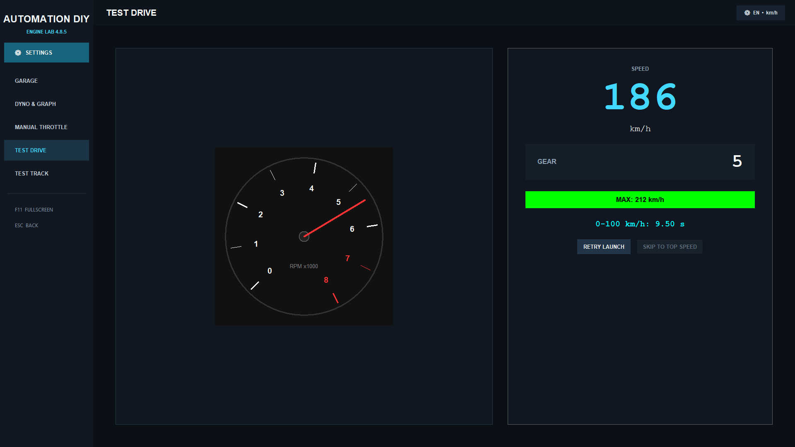
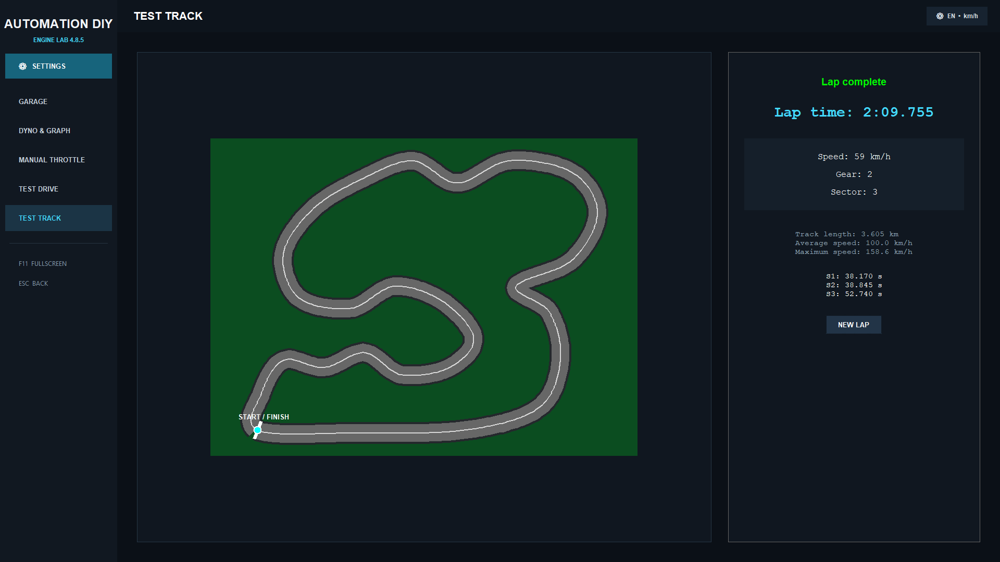

# Automation DIY — Simulátor motoru a vozidla

*[Read in English](README.md)*

Open-source simulátor stavby motoru, virtuálního dyna, dynamiky vozidla a času na kolo, inspirovaný žánrem her ve stylu „Automation“.

Postav motor od klikové hřídele nahoru, otestuj ho na virtuálním dynu, prověř chlazení při ručním plynu, změř zrychlení 0–100 km/h nebo 0–60 mph a maximální rychlost a nakonec pošli auto do deterministické simulace okruhu dlouhého 3,605 km. Zvuk motoru se generuje procedurálně a živě reaguje na otáčky, plyn, počet válců, typ plnění i klikovou hřídel.

> **Aktuální verze: v4.10.2 — Branding Update**



## Funkce

- **Fullscreen rozhraní v jediném okně** s brandovaným stálým levým menu, ikonou aplikace a okna, vloženými simulačními obrazovkami, chybovými overlayi a ovládáním přes F11/ESC
- **Centrální panel Nastavení** pro načítání a ukládání buildů, změnu jazyka, přepnutí mezi km/h a mph a bezpečné ukončení simulátoru
- **Skutečně prázdný výchozí projekt** pro stavbu vlastního motoru a vozidla od nuly a samostatné ovládací prvky **Název vozu / projektu** a **Preset motoru a vozu**
- **Stavba motoru a vozidla na 7 lokalizovaných záložkách**: Blok motoru, Spodek motoru, Hlava a rozvody, Plnění, Palivo a ladění, Výfuk, Vozidlo a pohon
- **Fyzikálně založená dyno simulace** s živým vloženým grafem momentu a výkonu a telemetrií otáček, momentu a výkonu
- **Nezávislé modely selhání motoru**:
  - mechanické přetočení podle nejslabší klikové hřídele, ojnic nebo pístů
  - klepání a detonace ovlivněné kompresí, plnicím tlakem, předstihem, AFR, palivovou mapou, oktanovým číslem, vstřikováním, materiálem hlavy a technologickou úrovní
- **Telemetrie s ručním plynem** s živou teplotou chladicí kapaliny a možností prasknutí těsnění pod hlavou při přehřátí
- **Simulace 0–100 km/h / 0–60 mph a maximální rychlosti**, která zohledňuje:
  - ztráty FWD/RWD/AWD, chování otevřeného diferenciálu a LSD a volitelný Launch Control
  - umístění motoru, rozložení hmotnosti vpředu/vzadu, rozvor, výšku těžiště a podélný přenos hmotnosti
  - šířku a směs pneumatik, tuhost odpružení, světlou výšku, typ a průměr brzd a volitelné ABS
  - čelní plochu, základní součinitel odporu, poloměr kola, valivý odpor a aerodynamický přítlak
  - odpor vyvolaný přítlakem podle aerodynamické účinnosti, takže rychlejší zatáčky znamenají horší rovinky
  - převodovky Manual, Automatic, DCT a Sequential se skutečnou dobou přerušení tahu při řazení
  - elektronický omezovač rychlosti i maximálku omezenou převody a otáčkami
  - živý převod jednotek, který mění zobrazení a cíl zrychlení, nikoliv fyziku vozidla
- **Volitelné jemné nastavení jednotlivých převodů** pro převodovky se 4–8 stupni
  - při vypnuté volbě zůstávají původní automatické sady převodů
  - po zapnutí lze každý převod upravit samostatně
  - vestavěné presety používají ve výchozím stavu automatické převody, takže si zachovávají své zavedené výsledky
- **Simulace okruhu dlouhého 3,605 km s letmým měřeným kolem**
  - tři měřené sektory
  - živé zobrazení rychlosti, převodu, sektoru a času kola
  - brzdné zóny, rychlostní limity v zatáčkách, třecí kružnice pneumatik, akcelerace, výsledný odpor, přítlak, limity brzd, vliv podvozku a rozložení hmotnosti, diferenciál a nastavenou dobu řazení
  - jedna společná geometrie pro fyziku i vykreslení, takže zobrazený okruh je přesně ten, který simulátor počítá
- **Procedurálně generovaný zvuk motoru** bez nahraných vzorků
- **Stabilní vestavěné nápovědy** vysvětlující inženýrský vliv parametrů; vždy se zobrazuje pouze jedna a bezpečně se zavírá při změně obrazovky
- **Bezpečné uložení a načtení** přenositelných JSON konfigurací motoru a vozidla včetně samostatného názvu/presetu projektu, parametrů vozidla z v4.10, kompatibilních výchozích hodnot a přísnější validace starších či poškozených souborů
- **Předvolby inspirované reálnými vozy** pro rychlý začátek
- **Plně dvojjazyčné UI**: čeština a angličtina, přepínatelné za chodu včetně aktivních a dokončených simulačních obrazovek
- **Volitelné jednotky rychlosti**: km/h s měřením 0–100 km/h, nebo mph s měřením 0–60 mph
- **Vysokootáčková motorsportová kalibrace** pro vhodné atmosférické krátkozdvihové závodní motory s ručně nastavitelným omezovačem až 20 000 RPM
- **Expertní ruční rozsahy** mimo běžný rozsah sliderů, například zdvih 20–150 mm a stálý převod 1,5–10,0
- **Responzivní rozhraní pro menší displeje** s automatickým scrollováním záložek a přeskupením mapy Simulace okruhu









## Jak začít

### Varianta A — Předkompilované Windows exe

Stáhni nejnovější `.exe` ze stránky [Releases](../../releases) a spusť ho přímo. Instalace Pythonu není potřeba.

> **Známý problém:** při prvním spuštění může antivirus, například Microsoft Defender nebo AVG, krátce zamknout soubor během kontroly nepodepsaného single-file exe. To se může projevit jednorázovou chybou při spuštění. Po dokončení prvního skenu obvykle stačí aplikaci spustit znovu.

### Varianta B — Spuštění ze zdrojového kódu

Vyžaduje Python 3.10+.

```bash
pip install -r requirements.txt
python automation_diy_4.10.2.py
```

Tyto čtyři soubory aplikace nech ve stejné složce. Tři obrazové soubory zajišťují branding v4.10.2; pokud některý chybí, simulátor se přesto spustí s původní textovou hlavičkou.

```text
automation_diy_4.10.2.py
automation_diy_banner.png
automation_diy_icon.png
automation_diy_icon.ico
```

`tkinter` je součástí většiny standardních instalací Pythonu pro Windows. Na některých linuxových distribucích může být potřeba doinstalovat ho přes systémového správce balíčků.

`sounddevice` a jeho PortAudio backend jsou volitelné. Pokud nejsou dostupné, Ruční plyn i Zkušební jízda dál fungují v tichém režimu a aplikace zobrazí instalační nápovědu.

Aplikace se spouští v režimu celé obrazovky. Klávesou **F11** fullscreen zapneš nebo vypneš. **Esc** zavře overlay, vrátí tě z jiného režimu do stavby motoru nebo při otevřené stavbě opustí fullscreen. Načítání, ukládání, jazyk, jednotky rychlosti a ukončení aplikace najdeš v levém panelu **Nastavení**.

### Sestavení Windows exe

Nainstaluj PyInstaller, otevři Příkazový řádek ve složce se čtyřmi soubory aplikace a spusť:

```bat
py -m pip install --upgrade pyinstaller
pyinstaller --noconfirm --clean --onefile --noconsole --name "Automation_DIY_4.10.2" --icon "automation_diy_icon.ico" --add-data "automation_diy_banner.png:." --add-data "automation_diy_icon.png:." --add-data "automation_diy_icon.ico:." "automation_diy_4.10.2.py"
```

Hotový soubor najdeš jako `dist/Automation_DIY_4.10.2.exe`. Sestavuj ho ve Windows; PyInstaller vytváří balíček pro operační systém a prostředí Pythonu, ve kterém právě běží.

### Doporučená struktura na GitHubu

Do repozitáře ulož zdrojový kód, branding a dokumentaci. Vygenerované `.exe` dej jako soubor k GitHub Release `v4.10.2`, nikoliv přímo mezi zdrojové soubory.

```text
automation_diy_4.10.2.py
automation_diy_banner.png
automation_diy_icon.png
automation_diy_icon.ico
requirements.txt
README.md
README.cz.md
CHANGELOG.md
docs/
  NAVOD.md
  USER_GUIDE.md
```

Do repozitáře neukládej `build/`, `dist/`, `__pycache__/` ani vygenerovaný `Automation_DIY_4.10.2.spec`, pokud záměrně nespravuješ vlastní spec soubor.

## Typický postup

1. Zadej samostatný **Název vozu / projektu**.
2. Z **Blank Project** nastav všechna pole motoru a vozidla, nebo přes **Preset motoru a vozu** načti kompletní startovní konfiguraci. Výběr presetu zároveň přepíše název projektu, který potom můžeš znovu upravit.
3. Spusť **1. Dyno Pull** a sleduj živý graf a telemetrii.
4. Na obrazovce Dyna si prohlédni dokončené křivky momentu a výkonu.
5. Volitelně spusť **2. Ruční plyn**.
6. Spusť **3. Zkušební jízdu** pro 0–100 km/h nebo 0–60 mph a maximální rychlost.
7. Spusť **4. Simulaci okruhu** pro srovnatelný čas letmého kola.
8. Až budeš s buildem spokojený, pojmenuj ho a otevři **Nastavení → Uložit motor / vozidlo jako...**.

Kompletní vysvětlení rozhraní, Nastavení, jednotek rychlosti, všech záložek, simulačních režimů, modelů selhání, vlastních převodů a simulace okruhu najdeš v **[NAVOD.md](docs/NAVOD.md)**.

## Rozsah simulace

Automation DIY je přístupný herní inženýrský simulátor, nikoliv náhrada profesionálního softwaru pro simulaci spalovacího cyklu, CFD, víceprvkovou dynamiku vozidla nebo motorsportovou simulaci času na kolo.

Výsledky jsou deterministické a vhodné pro porovnávání buildů uvnitř simulátoru. Reálné hodnoty ovlivňují také jevy, které model neřeší, například teplota pneumatik, geometrie podvozku, povrch vozovky, počasí, chování řidiče, přechodová odezva turba, výrobní tolerance a podrobný průběh spalování.

## Upozornění

Některé vestavěné předvolby odkazují na reálné výrobce a modely jako na ilustrativní výkonnostní srovnání. Jde o neoficiální fanouškovské aproximace vytvořené pro vzdělávací a zábavní účely. Projekt není s uvedenými výrobci propojen, podporován jimi ani z jejich dat přímo odvozen.

## Poděkování

Inspirováno žánrem hry *Automation: The Car Company Tycoon Game*. Jde o nezávislý hobby projekt bez jakékoli spojitosti s touto hrou nebo jejími vývojáři.

## Přispívání

Projekt vyrostl z jednoho postupně rozvíjeného skriptu přes mnoho iterací, takže současný kód stále žije převážně v jednom velkém souboru.

Pull requesty jsou vítány. Rozdělení projektu například na moduly `physics.py`, `audio.py`, `gui.py`, `track.py` a `presets.py` by bylo hodnotným prvním příspěvkem ke snadnější údržbě a testování.
