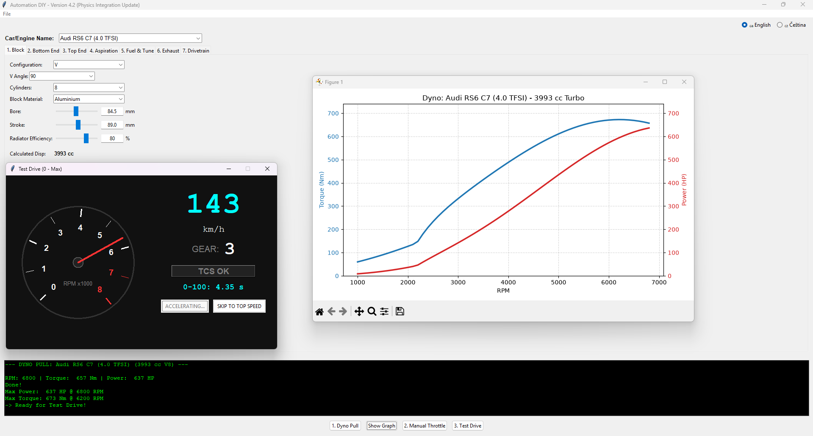

# Automation DIY — Engine & Vehicle Simulator

*[Čti v češtině / Read in Czech](README.cz.md)*

A homemade, open-source engine-building and dyno simulator inspired by the "Automation"-style car tycoon genre. Design an engine from the crankshaft up, run it on a virtual dyno, push it through a manual-throttle cooling test, then take it for a 0–100 test drive — complete with procedurally generated engine sound that reacts live to RPM, throttle, cylinder count, and crank type.



## Features

- **7-tab engine builder**: Block, Bottom End, Top End, Aspiration, Fuel & Tune, Exhaust, Drivetrain
- **Physics-based dyno simulation** — torque/HP curve generation, with two independent failure modes: mechanical over-rev (crankshaft/conrods/pistons, whichever is weakest) and knock/detonation (compression, ignition timing, AFR, octane, head material)
- **Manual throttle telemetry mode** — hold the throttle and watch coolant temperature; overheating blows the head gasket
- **0–100 test drive simulation** — weight transfer, FWD/RWD/AWD traction modeling, tire grip limits, gear shifting, launch control, top speed detection
- **Procedurally generated engine audio** — no samples, the waveform is synthesized live from your engine's spec
- **Built-in tooltips** explaining the real-world engineering effect of every single parameter
- **Save/Load** engine configurations as portable JSON files
- **Real-world-inspired presets** for quick starting points
- **Bilingual UI**: English / Czech, switchable at any time

## Getting Started

### Option A — Prebuilt Windows executable
Download the latest `.exe` from the [Releases](../../releases) page and run it directly. No Python installation required.

> **Known issue:** on first launch, your antivirus (Defender, AVG, etc.) may briefly lock a file it's scanning for the first time, which can surface as a one-off crash or error. This is a known side effect of unsigned single-file executables — if it happens, just relaunch the app; it will not recur once the file is scanned and cached.

### Option B — Run from source
Requires Python 3.10+.

```bash
pip install numpy matplotlib sounddevice
python engine_sim.py
```

`sounddevice` (and its PortAudio backend) is optional — if it's not available, the app runs normally with the sound button disabled instead of the live engine audio.

## How to Use

For a full walkthrough of every tab, the dyno/telemetry/test-drive workflow, and the failure models, see **[USER_GUIDE.md](docs/USER_GUIDE.md)**.

## Disclaimer

Some built-in presets reference real manufacturers and models (e.g. as illustrative performance benchmarks). These are unofficial, fan-made approximations included for educational purposes and are not affiliated with, endorsed by, or sourced from the referenced manufacturers.

## Credits

Inspired by the *Automation: The Car Company Tycoon Game* genre. This is an independent hobby project with no affiliation to that title or its developers.

## Contributing

This project grew from a single evolving script through many iterative versions, so the current codebase lives in one large file. Pull requests are welcome — a split into `physics.py` / `audio.py` / `gui.py` / `presets.py` modules is a good first contribution if you'd like to help with maintainability.

## License

*No license has been chosen yet.* Until a `LICENSE` file is added, standard copyright applies (all rights reserved) even though the source is public. If you intend this to be genuinely open-source, add a `LICENSE` file before publishing — MIT is the simplest permissive option; GPLv3 if you want forks to stay open.
