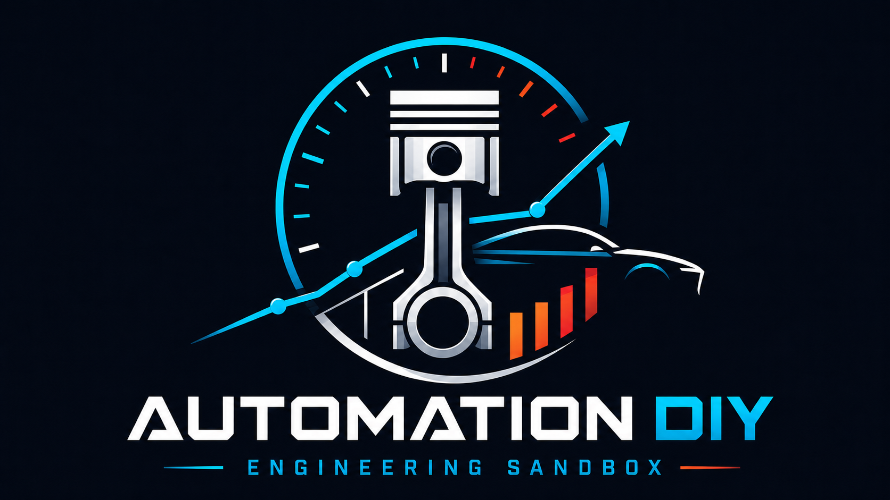

# Automation DIY — Engine & Vehicle Simulator

*[Čti v češtině / Read in Czech](README.cz.md)*

An open-source engine-building, dyno, vehicle, and lap-time simulator inspired by the "Automation"-style car tycoon genre.

Build an engine from the crankshaft up, run it on a virtual dyno, test its cooling under manual throttle, measure 0–100 km/h or 0–60 mph and top speed, then send the car through a deterministic 3.605 km Track Simulation. Engine sound is generated procedurally and reacts live to RPM, throttle, cylinder count, aspiration, and crank type.

> **Current release: v4.10.2 — Branding Update**



## Features

- **Fullscreen single-window interface** with a branded permanent sidebar, application/window icons, embedded simulation screens, in-app error overlays, and F11/ESC navigation
- **Central Settings panel** for loading and saving builds, changing language, switching between km/h and mph, and safely quitting the simulator
- **A truly blank startup state** for building an original engine and vehicle from scratch, plus separate **Car / Project Name** and **Engine & Vehicle Preset** controls
- **7-tab engine and vehicle builder**: Block, Bottom End, Top End, Aspiration, Fuel & Tune, Exhaust, Vehicle & Drivetrain
- **Physics-based dyno simulation** with a live embedded torque/HP graph and real-time RPM, torque, and power telemetry
- **Independent engine failure models**:
  - mechanical over-rev, determined by the weakest crankshaft, connecting rod, or piston limit
  - knock/detonation, influenced by compression, boost, ignition timing, AFR, fuel map, octane, injection, head material, and technology level
- **Manual throttle telemetry mode** with live coolant temperature and head-gasket failure from overheating
- **0–100 km/h / 0–60 mph and top-speed simulation** with:
  - FWD/RWD/AWD losses, Open/LSD differential behavior, and optional Launch Control
  - engine location, front/rear weight distribution, wheelbase, centre-of-gravity height, and longitudinal weight transfer
  - tire width and compound, suspension stiffness, ride height, brake type and diameter, and optional ABS
  - frontal area, base drag coefficient, wheel radius, rolling resistance, and aerodynamic downforce
  - downforce-induced drag controlled by aerodynamic efficiency, so extra cornering performance costs straight-line speed
  - Manual, Automatic, DCT, and Sequential gearboxes with real shift-interruption time
  - electronic speed limiting and RPM/gearing-limited top speed
  - live unit conversion that changes presentation and the acceleration target without changing the vehicle physics
- **Optional individual gear-ratio tuning** for 4–8-speed transmissions
  - leave it disabled to retain the original automatic ratio sets
  - enable it to edit every ratio independently
  - built-in presets keep automatic gearing by default, preserving their established performance
- **3.605 km Track Simulation with a flying timed lap**
  - three timed sectors
  - live speed, gear, sector, and lap-time telemetry
  - braking zones, corner-speed limits, tire friction-circle behavior, acceleration, effective drag, downforce, brake limits, suspension/weight-balance effects, differential behavior, and configured shift time
  - one shared track geometry for both physics and rendering, so the displayed circuit is the circuit being simulated
- **Procedurally generated engine audio** with no prerecorded engine samples
- **Stable built-in tooltips** explaining each parameter, limited to one active tooltip and cleaned up safely during screen changes
- **Safe Save/Load** of portable JSON engine and vehicle configurations, including separate project-name/preset state, v4.10 vehicle parameters, compatibility defaults, and stricter validation for older or malformed files
- **Real-world-inspired presets** for quick starting points
- **Fully bilingual UI**: English and Czech, switchable at runtime across active and completed simulation screens
- **Selectable speed units**: km/h with 0–100 km/h timing, or mph with 0–60 mph timing
- **High-RPM motorsport calibration** for suitable naturally aspirated, short-stroke race engines with manually entered limits up to 20,000 RPM
- **Expert manual ranges** beyond the normal slider ranges, including 20–150 mm stroke and 1.5–10.0 final drive
- **Responsive small-screen layouts** with automatic tab scrolling and a Track Simulation panel that rearranges itself when the window is narrow


## Getting Started

### Option A — Prebuilt Windows executable

Download the latest `.exe` from the [Releases](../../releases) page and run it directly. No Python installation is required.

> **Known issue:** on first launch, antivirus software such as Microsoft Defender or AVG may briefly lock a file while scanning an unsigned single-file executable. This can surface as a one-off launch error. Relaunching the app usually resolves it after the first scan is complete.

### Option B — Run from source

Requires Python 3.10+.

```bash
pip install -r requirements.txt
python automation_diy_4.10.2.py
```

Keep these four application files together. The three image files are required for the v4.10.2 branding; if one is missing, the simulator still starts with its text-header fallback.

```text
automation_diy_4.10.2.py
automation_diy_banner.png
automation_diy_icon.png
automation_diy_icon.ico
```

`tkinter` is included with most standard Windows Python installations. On some Linux distributions it may need to be installed separately through the system package manager.

`sounddevice` and its PortAudio backend are optional. If they are unavailable, Manual Throttle and Test Drive remain usable in silent mode and the app displays an installation guide.

The app starts in fullscreen mode. Press **F11** to toggle fullscreen and use **Esc** to close an overlay, return to the builder from another screen, or leave fullscreen when already in the builder. Load/Save, language, speed units, and Quit are available from **Settings** in the sidebar.

### Building the Windows executable

Install PyInstaller, open Command Prompt in the folder containing the four application files, and run:

```bat
py -m pip install --upgrade pyinstaller
pyinstaller --noconfirm --clean --onefile --noconsole --name "Automation_DIY_4.10.2" --icon "automation_diy_icon.ico" --add-data "automation_diy_banner.png:." --add-data "automation_diy_icon.png:." --add-data "automation_diy_icon.ico:." "automation_diy_4.10.2.py"
```

The finished file is `dist/Automation_DIY_4.10.2.exe`. Build it on Windows; PyInstaller creates bundles for the operating system and Python environment on which it is run.

### Recommended GitHub layout

Keep source files and documentation in the repository, but publish the generated `.exe` as an asset of the `v4.10.2` GitHub Release rather than committing build output.

```text
automation_diy_4.10.2.py
automation_diy_banner.png
automation_diy_icon.png
automation_diy_icon.ico
requirements.txt
README.md
README.cz.md
CHANGELOG.md
docs/
  NAVOD.md
  USER_GUIDE.md
```

Do not commit `build/`, `dist/`, `__pycache__/`, or the generated `Automation_DIY_4.10.2.spec` unless you intentionally maintain a custom spec file.

## Typical Workflow

1. Enter a separate **Car / Project Name**.
2. Configure every engine and vehicle field from **Blank Project**, or select an **Engine & Vehicle Preset** to load a complete starting point. Selecting a preset also replaces the project name, which you can edit afterwards.
3. Run **1. Dyno Pull** and watch the live graph and telemetry.
4. Inspect the completed torque and power curves on the Dyno screen.
5. Optionally run **2. Manual Throttle**.
6. Run **3. Test Drive** for 0–100 km/h or 0–60 mph and top speed.
7. Run **4. Track Simulation** for a comparable flying-lap result.
8. Name your vehicle and open **Settings → Save engine / vehicle as...** when you are happy with the build.

For a complete explanation of the interface, Settings, speed units, every tab, simulation mode, failure model, custom gearing, and Track Simulation, see **[USER_GUIDE.md](docs/USER_GUIDE.md)**.

## Simulation Scope

Automation DIY is designed as an accessible game-style engineering simulator, not as a replacement for professional engine-cycle, CFD, multibody vehicle-dynamics, or motorsport lap-simulation software.

The output is deterministic and useful for comparing builds inside the simulator, but real-world results also depend on factors that are outside the model, including tire temperature, suspension geometry, road surface, weather, driver behavior, transient turbo response, component tolerances, and detailed combustion behavior.

## Disclaimer

Some built-in presets reference real manufacturers and models as illustrative performance benchmarks. They are unofficial, fan-made approximations included for educational and entertainment purposes. This project is not affiliated with, endorsed by, or sourced from the referenced manufacturers.

## Credits

Inspired by the *Automation: The Car Company Tycoon Game* genre. This is an independent hobby project with no affiliation to that title or its developers.

## Contributing

The project grew from one evolving script through many iterative versions, so the current codebase still lives mainly in one large file.

Pull requests are welcome. Splitting the project into modules such as `physics.py`, `audio.py`, `gui.py`, `track.py`, and `presets.py` would be a valuable first contribution toward easier maintenance and testing.
